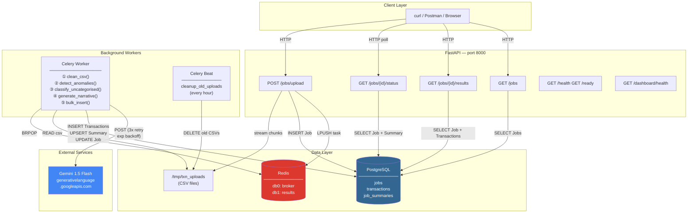
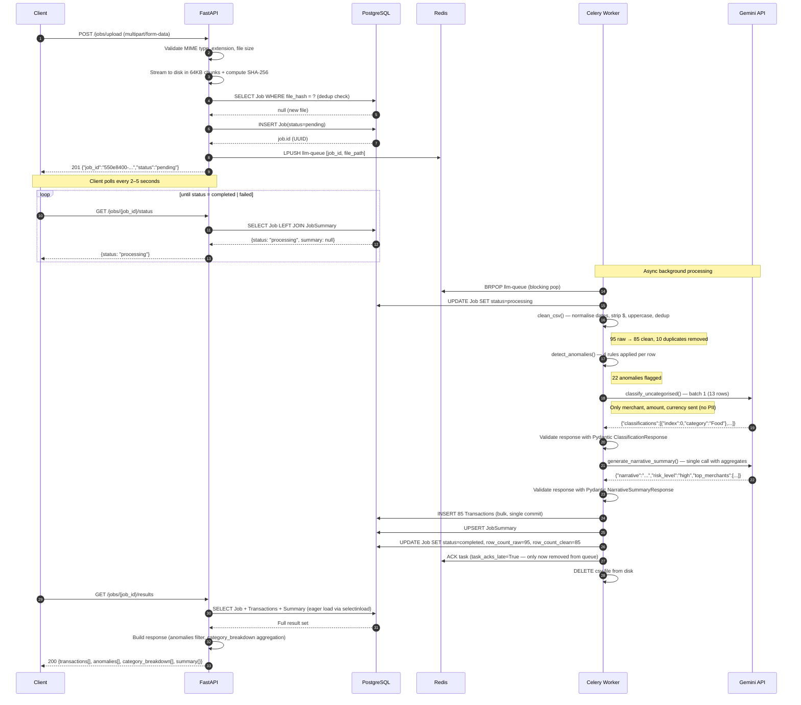
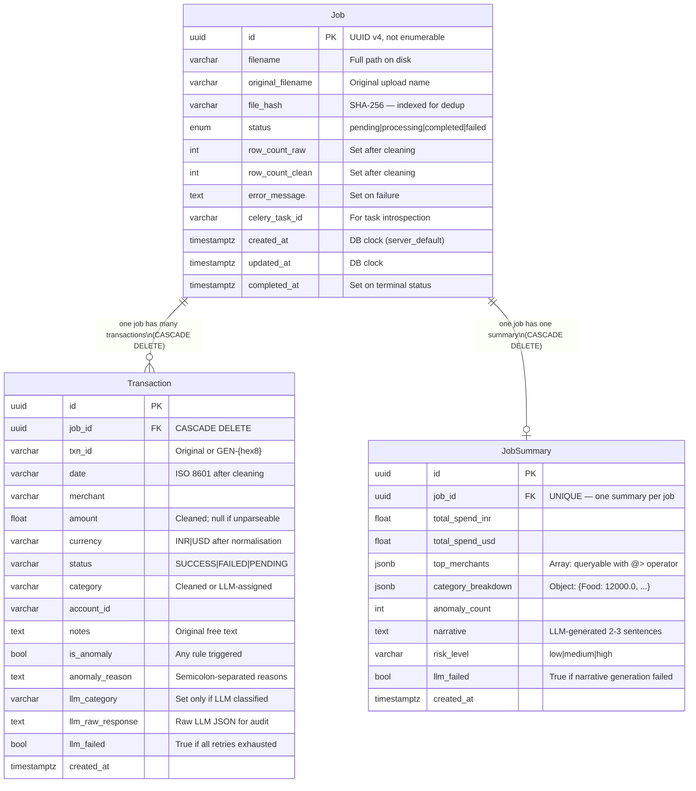
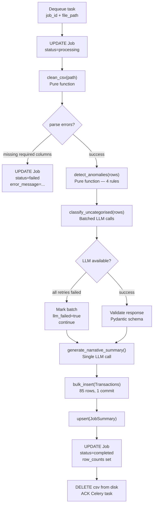
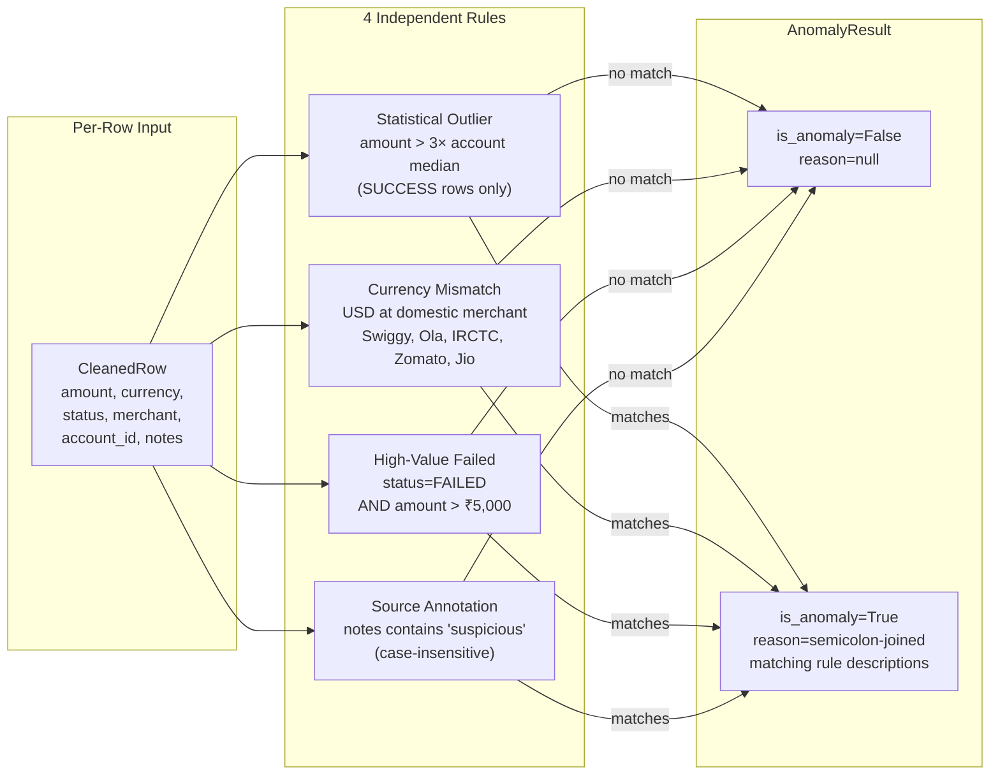
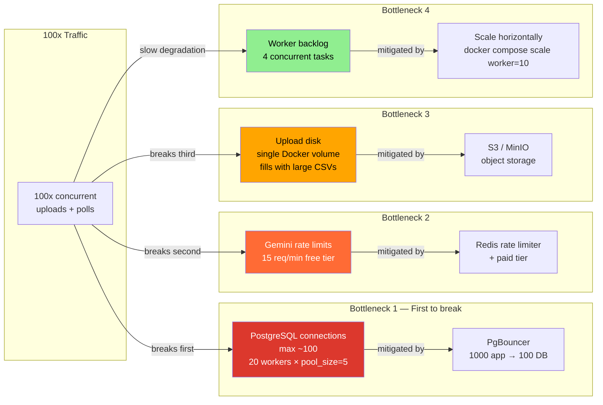

# Architecture Diagrams

All diagrams are written in Mermaid and render natively on GitHub.
For draw.io, paste the diagram source at [draw.io](https://app.diagrams.net/) using `Extras > Edit Diagram`.

---

## 1. System Component Diagram

---

## 2. Request Sequence Diagram — Upload to Result

---

## 3. Entity-Relationship Diagram

---

## 4. Data Flow — What Happens Inside the Worker

---

## 5. Anomaly Detection Rules

---

## 6. Scalability Bottleneck Map

